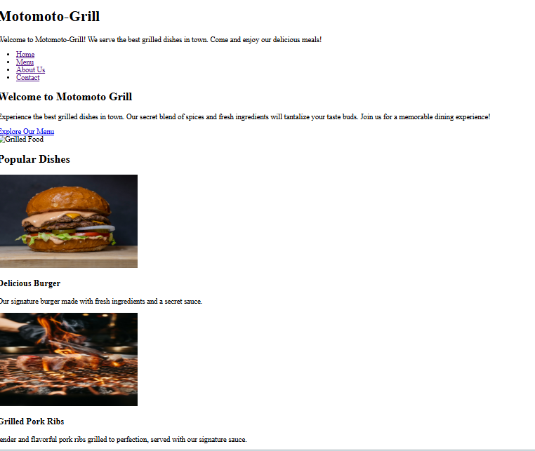

# Motomoto-grill
Motomoto-grill is a simple restaurant website project showcasing a fictional grill restaurant based in Nairobi,kenya.

It represents more than just food as it reflects a vibrant grill culture centered around smoky flavours,quality meals, and memorable customer experience.
 
 ## Project brief

The goal of this project is to design a simple restaurant website that includes:

- A homepage introducing the restaurant
- A Menu section showcasing food items
- A contact page for customer inquiries
- A clean and structured layout using html
The project focuses on clarity, structure, and visual presentation rather than complex functionality.

---

## Technology used

- HTML5
- Basic folder organization (assets/images)
---

## setup instructions
To run this project locally
1. Clone the repository:
```bash
git clone https://wanjiruaisha/Motomoto-grill.git
```
2. Navigate into the project folder:
```bash
cd Motomoto-grill
```
3. Open `index.html` in your browser :
- Double click the file, or 
- Use live server
---

## 📁 Project Structure

```text
motomoto-grill/
├── index.html
├── contact.html
├── README.md
└── assets/
    └── images/
        ├── grilled-food.jpg
        ├── burger.jpg
        └── grilled-pork-ribs.jpg
```
## screenshots

This is an example of the home page view

## Business Rationale
Motomoto-grill represents a a modern grill restaurant concept targeting customers who enjoy fast,flavorful and freshly prepared meals.The website was designed to reflect:
- A strong visual food identity
- Easy access to contact information
- A modern digital presence for a restaurant brand

---

## Author
 Built as a learning project to practise HTML,Git and Github workflow


 


